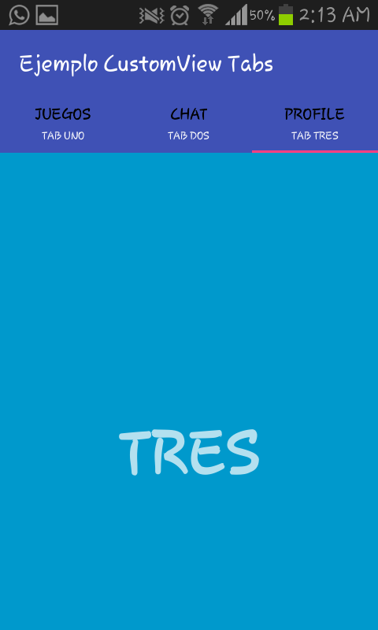

# Android Material Tabs: 

Aprendiendo como crear en Android Studio distintos tipos de Barras Laterales
como por ejemplo: Scroll Tabs, Custom Tabs, Tabs con Iconos, Tabs Texto e Iconos

-          # William Gustavo Santisteban : LinkedIn: https://ar.linkedin.com/in/gustavosantisteban

La aplicación consta de mostrar un listado de Buttons y cada uno redireccionará a su Layout correspondiente:

